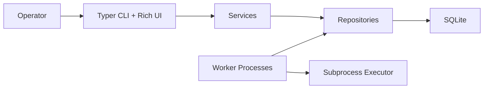

# QueueCTL

queuectl is a production-style CLI background job queue for running shell commands with durable SQLite persistence, parallel workers, retries, a dead-letter queue, configuration, metrics, and polished terminal output.

## Features

- Enqueue JSON-defined jobs from the command line.
- Run multiple worker processes in parallel.
- Prevent duplicate execution with transactional optimistic claims.
- Retry failures with exponential backoff.
- Move exhausted jobs to a dead-letter queue.
- Persist jobs, workers, retry schedules, output logs, and configuration in SQLite.
- Gracefully stop workers after the current job finishes.
- Capture stdout, stderr, exit code, and execution time.
- Support job timeout, priority, scheduled `run_at`, metrics, and a minimal live dashboard.
- Render status, job lists, DLQ views, config, and metrics with Rich tables.

## Architecture



See [design.md](design.md) for details on concurrency, retries, persistence, and trade-offs.

## Setup

```bash
python -m venv .venv
source .venv/bin/activate
python -m pip install --upgrade pip
python -m pip install -e ".[dev]"
```

On Windows PowerShell:

```powershell
py -3.11 -m venv .venv
.\.venv\Scripts\Activate.ps1
python -m pip install --upgrade pip
python -m pip install -e ".[dev]"
```

By default, queuectl stores data at `~/.queuectl/queuectl.db`. Override it with:

```bash
export QUEUECTL_DATABASE_URL=sqlite:///./queuectl.db
```

## CLI Examples

Enqueue a job:

```bash
queuectl enqueue '{"id":"job1","command":"echo hello","priority":"high"}'
```

Start workers:

```bash
queuectl worker start --count 3
```

Stop workers from another terminal:

```bash
queuectl worker stop
```

Check status:

```bash
queuectl status
```

List jobs by state:

```bash
queuectl list --state pending
```

Inspect and retry the DLQ:

```bash
queuectl dlq list
queuectl dlq retry job1
```

Configure retries:

```bash
queuectl config set max-retries 3
queuectl config set backoff-base 2
queuectl config list
```

Show metrics:

```bash
queuectl metrics
```

## Job Payload

```json
{
  "id": "unique-job-id",
  "command": "echo 'Hello World'",
  "max_retries": 3,
  "timeout": 60,
  "priority": "medium",
  "run_at": "2026-01-01T10:00:00Z"
}
```

Required fields are `id` and `command`. Defaults come from persisted configuration.

## Example Outputs

Status:

```text
Queue Status

+-----------------+-------+
| Metric          | Value |
+-----------------+-------+
| Active workers  |     3 |
| Pending jobs    |     5 |
| Processing jobs |     2 |
| Completed jobs  |    21 |
| Failed jobs     |     1 |
| Dead jobs       |     2 |
+-----------------+-------+
```

Metrics:

```text
Queue Metrics

+------------------------+--------+
| Metric                 | Value  |
+------------------------+--------+
| Total jobs             | 29     |
| Completed jobs         | 24     |
| Failed jobs            | 1      |
| Dead jobs              | 2      |
| Success rate           | 82.76% |
| Average execution time | 0.184s |
| Active workers         | 3      |
+------------------------+--------+
```

Text captures live in [docs/sample-screenshots](docs/sample-screenshots).

## Database Schema

`jobs`

- `id`, `command`, `state`, `attempts`, `max_retries`
- `timeout`, `priority`, `run_at`, `next_run_at`
- `created_at`, `updated_at`, `locked_by`, `locked_at`, `last_worker_id`
- `stdout`, `stderr`, `exit_code`, `execution_time`, `last_error`

`workers`

- `id`, `pid`, `hostname`, `status`
- `started_at`, `last_heartbeat`, `stopped_at`
- `current_job_id`, `stop_requested`

`config`

- `key`, `value`, `updated_at`

## Design Decisions

- Repository pattern hides SQLAlchemy details from CLI and services.
- Service layer exposes use cases that are easy to test directly.
- Atomic conditional updates prevent two workers from claiming the same job.
- Failed jobs remain in `failed` while waiting for backoff, making retries observable.
- Rich is isolated to the CLI so core behavior stays testable.
- Worker stop requests are persisted so a separate `queuectl worker stop` command can coordinate shutdown.

## Testing

```bash
pytest
```

The test suite covers:

- Successful job execution.
- Failure, retry, and DLQ movement.
- Multiple workers without overlapping execution.
- Invalid commands failing gracefully.
- Persistence across a restarted service.

## Seed and Demo

Seed sample jobs:

```bash
python scripts/seed.py
```

Run a guided demo:

```bash
bash scripts/demo.sh
```

PowerShell:

```powershell
.\scripts\demo.ps1
```

## Docker

Build and run:

```bash
docker build -t queuectl .
docker run --rm -v queuectl-data:/data queuectl status
```

With Compose:

```bash
docker compose run --rm queuectl status
```

## Demo Recording Section

Suggested recording flow:

1. Show `queuectl config list`.
2. Enqueue success, failure, priority, timeout, and scheduled jobs.
3. Start `queuectl worker start --count 3`.
4. Run `queuectl status`, `queuectl list`, `queuectl dlq list`, and `queuectl metrics`.
5. Retry a DLQ job and stop workers gracefully.

## Future Improvements

- Alembic migrations.
- Prometheus metrics exporter.
- Named queues and worker capability filters.
- Containerized command executor.
- Web or TUI dashboard with historical charts.
