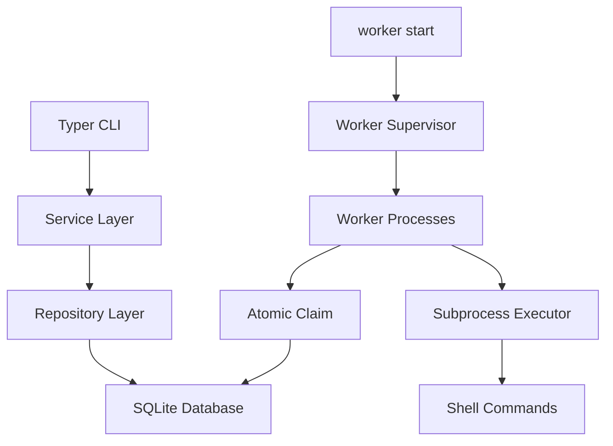

# queuectl Design

## Goals

queuectl is a local-first background job queue for running shell commands from a CLI. The design favors a small operational footprint, durable storage, and predictable worker behavior over distributed-system complexity.

## Architecture



## Layers

- `queuectl.cli`: Typer commands and Rich rendering only.
- `queuectl.services`: use cases such as enqueueing, status, worker control, metrics, and DLQ retry.
- `queuectl.storage`: SQLAlchemy engine setup, ORM records, and repositories.
- `queuectl.core`: domain models, retry math, time helpers, command execution, and compatibility exports.

This separation keeps terminal concerns out of the worker engine and makes service tests straightforward.

## Persistence

SQLite stores jobs, workers, and configuration. The engine enables WAL mode, foreign keys, and a busy timeout for better concurrent access from multiple worker processes.

Tables:

- `jobs`: command payload, lifecycle state, retry counters, schedule fields, lock metadata, and output capture.
- `workers`: process metadata, heartbeat, current job, and persisted stop requests.
- `config`: key-value runtime configuration.

## Concurrency Model

SQLite does not expose portable row-level locking. queuectl uses an optimistic atomic claim:

1. Select due jobs in priority and creation order.
2. Attempt `UPDATE jobs SET state='processing' WHERE id=:id AND state IN ('pending','failed')`.
3. Only the worker whose update affects one row owns the job.

The conditional update is the critical section. Competing workers may see the same candidate, but only one can transition it to `processing`.

## Worker Lifecycle

`queuectl worker start --count N` launches N worker processes and waits in the foreground. Each worker:

1. Registers itself in the `workers` table.
2. Heartbeats while idle or busy.
3. Claims one due job at a time.
4. Executes the command with optional timeout.
5. Marks success as `completed`.
6. Marks failure as `failed` with `next_run_at`, or `dead` once attempts are exhausted.
7. Exits cleanly when a persisted stop request or OS signal is received.

`queuectl worker stop` sets stop flags in the database. Workers finish the current job before leaving the loop.

## Retry and DLQ

Backoff is calculated as:

```text
delay = backoff_base ** attempts
```

The default base is `2`, so attempts wait 2, 4, and 8 seconds. Failed jobs stay in `failed` during their backoff window and are claimable again after `next_run_at`. Once `attempts >= max_retries`, a job moves to `dead` and appears in the DLQ.

`queuectl dlq retry JOB_ID` resets attempts and returns the job to `pending`.

## Trade-offs

- SQLite keeps setup simple, but it is not a replacement for a distributed queue under high write contention.
- Shell execution is intentional because the product is a command queue. Commands should be submitted only by trusted operators.
- `failed` represents a retry-scheduled state, which makes backoff visible in `queuectl list --state failed`.
- The worker supervisor runs in the foreground. A production deployment can run it under systemd, Docker, or another process manager.

## Future Improvements

- Alembic migrations for schema evolution.
- Per-queue routing and worker capabilities.
- Structured stdout/stderr artifacts on disk or object storage.
- Web dashboard and Prometheus exporter.
- Pluggable executors for containers or remote hosts.

